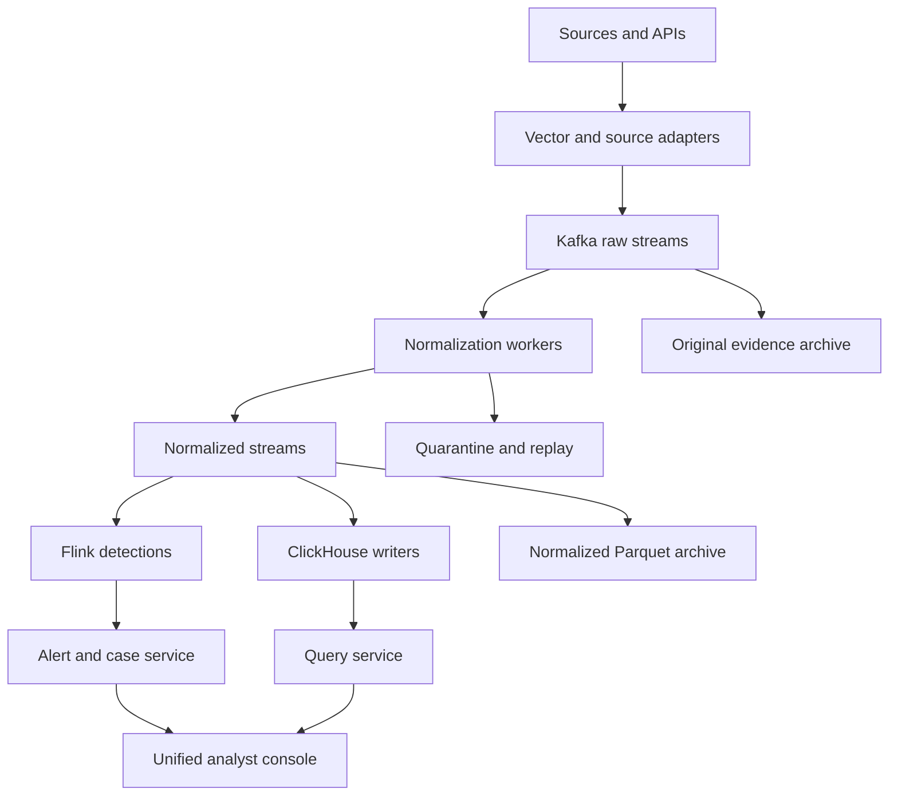

> v0.4: Current behavior and remaining gates are documented in ENTERPRISE_CONTROLS.md, CORRELATION.md, VALIDATION.md and ENTERPRISE_GATES.md. Newer guides take precedence over this historical description.

> v0.3 update: see [RELEASE_v0.3.md](RELEASE_v0.3.md) and [VALIDATION.md](VALIDATION.md) for current implementation status. The previous single-rule detector is replaced by the shared declarative rule evaluator; package signatures and JWT access-token validation are optional additions. Distributed runtime validation remains open.

# Clean-sheet target architecture

This document describes the production target. Version 0.2 now includes an intermediate distributed laboratory implementation; see DISTRIBUTED_LAB.md for its actual code path and limitations. It is not the full target and was not deployed in the authoring environment.

## Boundaries

Data plane: collectors, durable streams, normalization, detection, storage writers and archive. Management plane: identity, tenant policy, package registry, installation lifecycle, metadata, cases and orchestration. Operations plane: metrics, traces, capacity controller and guarded repair. A management outage does not invalidate last-known-good collector configuration. Separate service credentials, data paths, quotas and failure domains.

Start with a modular Go control-plane service and independently scalable data workers. Use PostgreSQL for control metadata. Do not make every UI feature a separate microservice. Introduce Temporal only when durable multistep workflows justify it. Use OTel instrumentation and Prometheus metrics from the first distributed build.

## Event and acknowledgement contract

Collector identity determines tenant. Collector assigns a stable source event ID before retry. Preserve source timestamp, timezone and confidence; record first receipt, normalized time and sink acknowledgement separately. Keep original bytes and checksum, schema/parser version, source checkpoint, Kafka location and replay context.

A platform acknowledgement means durable acceptance within a named failure model. UDP and unacknowledged syslog cannot provide end-to-end delivery confirmation. Configure durable edge buffers and explicit overflow policies. Never claim zero loss without the source/protocol and fault-domain assumptions.

Commit input positions only after downstream durability. Quarantine is a durable outcome. For partial batches, advance only the safely handled contiguous input range. Idempotency must survive process restart and consumer reassignment.

Kafka-to-Kafka transformations may use transactions. Kafka-to-ClickHouse/archive/response has a cross-system boundary and needs stable identity plus retry-aware sink/query behavior. Retry deduplication windows are not permanent uniqueness. Raw-message content alone is not a safe event ID because identical messages may represent different occurrences.

## Partitioning and scaling

Separate critical-security, bulk and replay workload classes. Do not use one topic per device by default. Hash on a key that balances stateless stages; repartition stateful detections by tenant/entity. An unusually active identity or device may remain a hot key: use bounded preaggregation where semantics permit and explicit degradation alerts where it does not.

Scale using bytes/s, service time, backlog age/growth, assigned partitions, downstream saturation and failure headroom. Traditional consumer-group parallelism is bounded by partition count. More replicas do not create more partition throughput. Backlog/consumer rate is not a reliable oldest-record age estimator; measure record age.

A shared cluster can still propagate outages through disk exhaustion. Reserve capacity and apply tenant/workload quotas. Replay yields first. API producers receive explicit throttling; collectors buffer durably within their quotas. No evidence sampling without an explicit collection policy.

## Storage and query

ClickHouse stores typed common security fields and bounded vendor attributes. Design partition/sort keys from measured queries; avoid one table/partition per device and uncontrolled cardinality. The query service compiles a safe typed filter language, supplies tenant enforcement, bounds scanned time/bytes, cancels costly work and reports completeness/freshness. No arbitrary tenant-provided SQL against shared storage.

Archive original bytes plus signed manifests and normalized Parquet. Retention, legal hold and authorized deletion are separate policies with auditable precedence. Rehydrate into a low-priority replay stream. Avoid a second hot search engine until measured full-text deficiencies justify it.

## Detection semantics

Rules compile from a supported Sigma subset into a typed internal representation. Rule version and mapping version form part of evaluation identity. Stateful detections declare key, window, watermark/lateness behavior, state TTL, suppression and output idempotency. Correlation uses event time, while health measures first receipt to evaluation. Missing input data makes coverage unknown/degraded.

Upgrade rules with shadow evaluation and explicit state migration/reset policy. Replay carries original event identity and a replay reason; response actions are suppressed by default. Late data may create a retrospective finding clearly marked as such. Detection output must not require the analytical store to be healthy.

## Self-monitoring and repair

Metrics include accepted bytes/events, queue occupancy, pending age, parse completeness, sink visibility latency, rule evaluation delay, quarantine growth, error budgets and forecast storage exhaustion. Keep high-cardinality event/source details out of Prometheus labels; use an accounting store and bounded aggregations.

Record historical worker/partition assignment intervals, batch acknowledgements and sampled stage traces. Synthetic canaries verify ingestion through detection and query. A separate watchdog checks the monitoring service itself.

Recovery workflow: diagnose → confirm preconditions → acquire scoped lease → execute bounded action → verify → roll back/escalate. Include attempt limit, cooldown, signed desired configuration, authorization and immutable audit. Never automatically disable security controls, purge evidence, reset offsets or change network routing based only on a generic error string.

## Deployment and release profiles

Local development uses the current standalone reference. The first production target is a documented Kubernetes/Helm profile with managed or operator-supported stateful services and independent persistent volumes/failure domains. A self-hosted VM profile is an additional support commitment, not automatically certified. Offline distribution includes dependency images/packages, signatures, migrations and rollback assets.

SaaS regions must enforce residency across data, backups, telemetry, support bundles and AI providers. Customer-managed identity and secrets must not depend on a consumer cloud account. Region failover needs measured RPO/RTO and a plan for duplicate ingestion, collector routing and response ownership.

## Benchmark specification

Workload tiers are targets, not claims: 10k, 50k and 100k EPS with declared raw sizes (e.g. 300 B, 1 KB, 5 KB distributions), tenant counts, source skew and 2x bursts. At 50k EPS and 1,000 bytes/event, raw input is 4.32 TB/day before compression; every replicated stream and projection adds cost.

Run 24-hour steady and 72-hour soak tests with live rules, query concurrency and failures. Compare ClickHouse with the search alternative on exact filters, wildcards/full-text, entity timelines, high-cardinality aggregations and cold-data investigations. Measure p50/p95/p99, dropped/duplicate outcomes, CPU-hours, RAM, disk/network and cost. Test broker/worker loss, search outage, full disks, expired certificates, control-plane outage and source bursts.

Initial SLO proposals: p95 immediate-rule evaluation within 5 seconds of receipt; p95 hot-event search visibility within 10 seconds; no unexplained missing acknowledged IDs in the declared fault model. Window rules are timed relative to window/lateness completion. Define maximum query time and recovery targets per profile before quoting capacity. None is demonstrated by the local build.
