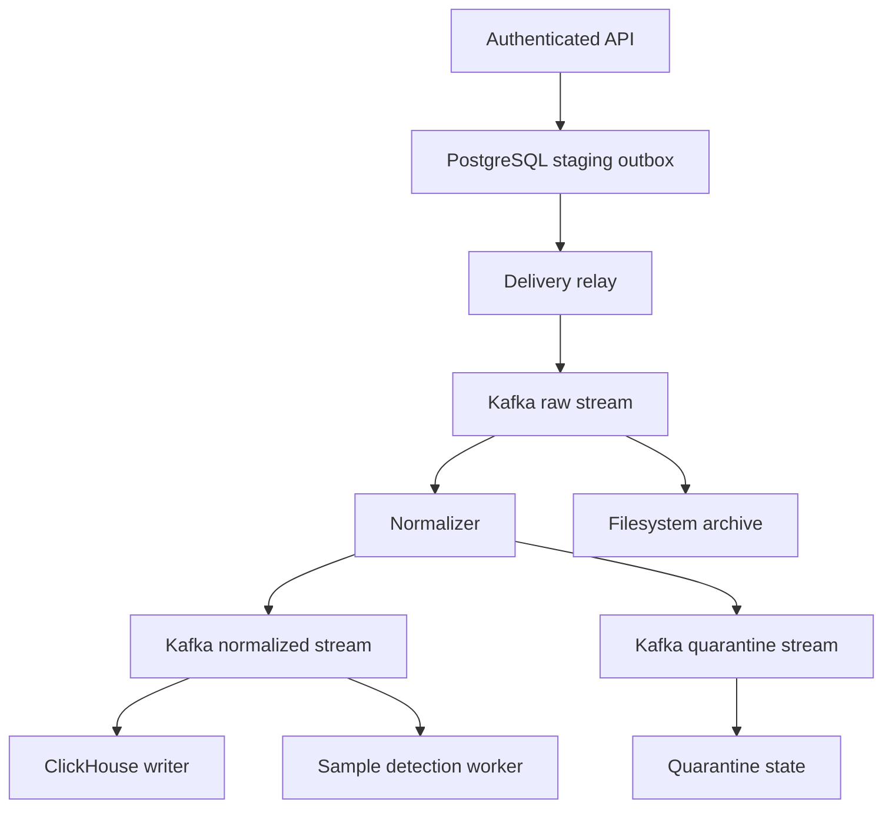

> v0.4: Current behavior and remaining gates are documented in ENTERPRISE_CONTROLS.md, CORRELATION.md, VALIDATION.md and ENTERPRISE_GATES.md. Newer guides take precedence over this historical description.

> v0.3 update: see [RELEASE_v0.3.md](RELEASE_v0.3.md) and [VALIDATION.md](VALIDATION.md) for current implementation status. The previous single-rule detector is replaced by the shared declarative rule evaluator; package signatures and JWT access-token validation are optional additions. Distributed runtime validation remains open.

# Distributed development profile — 0.2

## Current code path

The detector, quarantine worker, stage markers and case API also use PostgreSQL. The diagram shows event flow, not all control connections. The three Kafka topics have six partitions each in the lab. No connections to any previous SIEM are used.

## Why this intermediate implementation

The local reference's acceptance/identity invariants are preserved through PostgreSQL transactions and an outbox. Raw staging payloads are removed after broker acknowledgement, while lightweight receipts remain for identity checking and operational status. This supplies a concrete cross-process integration path without pretending a language change or a broker alone proves better performance.

The per-tenant advisory lock and receipt cap intentionally bound this laboratory design. It is not the final peak-EPS gateway. The sample detector still uses PostgreSQL state and opens transactions per event. Before scale claims, replace/batch the bottlenecks using measured data and move stateful production detection to Flink. Metadata failure still affects workers that require stage markers; further isolation remains necessary.

## Acknowledgement boundaries

| Boundary | Success condition | Failure behavior |
|---|---|---|
| HTTP → staging | PostgreSQL transaction commits receipt/outbox/audit | Whole request rolls back; HTTP success is not returned |
| Staging → Kafka | All producer callbacks/flush confirm delivery | Outbox transaction remains uncommitted; previously sent messages may repeat |
| Kafka → normalized/quarantine | Output delivery confirmed, stage update committed | Source batch offsets do not advance |
| Kafka → ClickHouse | Synchronous insert completes; stage marker commits | Batch may repeat; query-time deduplication handles identical IDs/time |
| Kafka → detector | Seen-event state, alert and stage update commit | Redelivery does not increment a previously seen event |
| Kafka → archive | File and directory entries fsynced; checksum validated; stage update commits | Retry or stop; existing evidence is not silently accepted after corruption |

Producer idempotence is enabled, but it does not remove application-level retries across process sessions. Offset commits are synchronous and explicit per partition. Auto-commit and auto-offset-store are disabled. New consumer groups start at the beginning of currently retained data; an existing out-of-range offset causes an error instead of silently skipping to the latest/earliest data. There is no automatic expired-data restoration yet. The design follows the [Confluent Python client API](https://docs.confluent.io/platform/current/clients/confluent-kafka-python/html/index.html).

Malformed trusted-envelope records stop a worker without committing the batch. Attributable parser errors become quarantine records. A malformed record can therefore stall a worker until investigated; administrative poison-record remediation is a future gate.

## Deduplication and query behavior

The gateway binds tenant from authenticated credentials; request fields cannot select another tenant. Stable IDs are scoped to source. A duplicate ID with changed payload or integration returns 409, atomically rejecting the batch. Optional `sources` lists in credential records constrain collector identities to allowed source IDs.

ClickHouse uses ReplacingMergeTree with deterministic immutable event-time partitions and `(tenant,event_time,event_id)` sorting. Application reads use `FINAL`; background merges alone are insufficient for exact event counts. Inserts explicitly disable asynchronous buffering and wait for query completion. Both HTTP errors and execution errors inside a 200 response are treated as failed acknowledgements. Query parameters are typed, with mandatory tenant binding and fixed query structure. [ClickHouse HTTP interface](https://clickhouse.com/docs/interfaces/http)

This is not a general mutable-event store: changing source time or reinterpreting an already indexed event needs a separately designed revision policy. Cross-version parser upgrades and reindexing are not implemented.

## Integration snapshots and replay

The gateway captures the active package digest in each raw event. Workers require the installed package to match that digest; a changed local package cannot silently reinterpret backlog. A missing/mismatched package goes to quarantine. Activate an available package and replay to capture its digest. Replay preserves event identity, original receipt time and payload, increments a bounded generation and creates a new staging record.

The quarantine store checks accepted receipts to avoid resurrecting an error after successful normalization. Resolved records remain in storage but are omitted from the active issues list. Replay allows three attempts. The archive keeps separate content-addressed envelopes for original and replay attempts. These are canonical JSON envelopes, not original network bytes.

## Operational state

The console reports ingress receipts, search-visible rows, pending stage receipts, quarantine, alerts and worker errors. If ClickHouse is unavailable, searchable count shows Unavailable; it is not reported as zero. `/metrics` preserves distributed worker error state.

Pending stage age is measured from stored ingress receipt time; it is not Kafka consumer lag. Heartbeats are recorded every approximately five seconds when workers can progress/poll. A role with no live nonfailed worker within 60 seconds is unhealthy. Counts and heartbeat reporting are limited laboratory telemetry, not the independent monitoring stack planned for production.

## Deployment

Compose defines 11 services: PostgreSQL, ClickHouse, Kafka, schema/topic initialization, gateway, relay, normalizer, indexer, detector, quarantine and archive. Only host-loopback ports are published. Image versions and Python dependencies are pinned to explicit development versions, but image digests, compatibility and security posture have not been certified. These are not claimed to be the newest releases. Python package release references: [confluent-kafka 2.8.2](https://pypi.org/project/confluent-kafka/2.8.2/), [psycopg 3.2.6](https://pypi.org/project/psycopg/3.2.6/).

PostgreSQL transaction success/rollback relies on the driver's connection context semantics. SQL migrations are additive initialization only; there is no destructive migration. [Psycopg transaction documentation](https://www.psycopg.org/psycopg3/docs/basic/transactions.html)

The launcher generates passwords/tokens on first use and refuses to overwrite a partially present credential set. Plaintext tokens and environment secrets stay in a private directory and are excluded from the archive and container build context. The credential hash file is readable inside the nonroot application container. The launcher stops services without deleting volumes.

The supplied CI workflow is a definition, not an executed CI run or a published repository. It runs local tests and then the real Compose verification/fault scenarios when used in an appropriate runner.

## Remaining release gates

- Live image builds/startup, schema queries and Kafka client compatibility.
- Broker/metadata outages, process kill timing, rebalance/redelivery and disk-full behavior under real load.
- Multi-node quorum/replication, durable archive storage, backups and restore.
- Load/cost benchmarks, microbatch tuning, gateway scaling and retention/state cleanup policies.
- Independent monitoring, signed integration lifecycle, OIDC/TLS and backend least-privilege tenant enforcement.
- Real Vector collection, vendor fixtures, OCSF/Sigma conformance and the Flink engine.
- Browser visual/accessibility review.

Do not interpret the passing contract tests as passing these gates.
